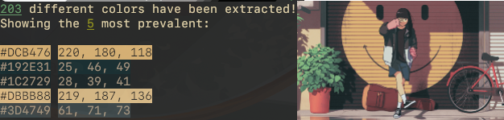

# 🎨 Paltone
A CLI for extracting a color palette from an image

## Website
You can now test Paltone online [here](https://paltone.chiwabox.dev/)!

## 🖌️ Features
- Extract colors from an image, listed by most used
- Generation of images with the color palette
- Extract the colors as a JSON string printed to the terminal

## 💾 Installation

### Requisites:
- cargo
- rust

Clone the repository and install by executing `cargo install --path .` in the repo directory

## 🗒️ Usage

```sh
Usage: paltone [OPTIONS] <COMMAND>

Commands:
  extract  Extract colors from an image and print the palette to the terminal
  json     Extract colors from an image and print the palette to the terminal as JSON string
  image    Extract colors from an image and save as another image file
  help     Print this message or the help of the given subcommand(s)

Options:
  -q, --quantity <QUANTITY>    Number of colors to show on the list
  -t, --tolerance <TOLERANCE>  Higher values will extract less colors
  -h, --help                   Print help
  -V, --version                Print version
```
